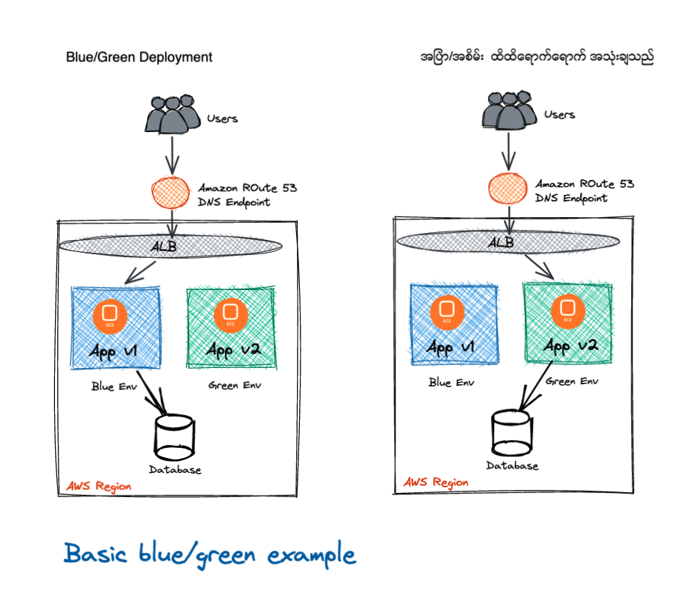

# AWS EC2 User Data Blue and Blue/Green Deployment using ALB

## Blue/Green Deployment Methodology
Blue/green deployments providenear zero-downtime release and rollback capabilities.The fundamental idea behindblue/green deployment is to shift traffic between two identical environments that are running  different versions of your application.The blue environment represents the current application version serving production  traffic.In parallel, the green environment is staged running  a different version of your application.After the green environment is ready and tested, production  traffic is redirected from blue to green.If any problems are identified, you can roll back by reverting traffic back to the blue environment.

## Benefits of Blue/Green
It was difficult to validate your new application version in a production deployment while also continuing to run your old version of the application. Bule/Green deployments provide a level of isolation between your blue and green appliction environments. It ensures spinning up a parallel green enviornment does not effect resoirces upderpinning your blue environment. This isolation reduces your deployment risk.

## Amazon Route 53
[Amazon Route 53](https://aws.amazon.com/route53/) is a highly available and scalable authoritative DNS service that routes user requests for Internet-based resources to the appropriate destination. Amazon Route 53 runs on a global  network of DNS servers providing customers with added features,such as routing based on health checks, geography, and latency. DNS is a classic  approach to blue/green deployments, allowing administrators to direct traffic by simply updating DNS records in the hosted zone.Also, time to live (TTL) can be adjusted for resource records; this is important for an effective DNS pattern because ashorter TTL allowsrecord changes to propagate faster to clients. 

## Update DNS Routing with Amaozon Route 53
DNS routing through record updates is a common  approach to blue/green deployments. DNS is the mechanism  for switching  traffic from the blue environment to the green and vice versa, if rollback is necessary. This approach works with a wide variety of environment configurations,  as long  as you can express the endpoint into the environment as a DNS name or IP address.



Follow the steps to completed the tasks.

## 1. Clone the git repository
```bash
git clone https://github.com/itkyawkyawnaing/blue-green-deployment-alb-cloudformation.git
```
This will clone my git repository to your local directory.

## 1. Create VPC with AWS CloudFormation template "vpc.yaml"

```bash
aws cloudformation create-stack --stack-name sgpvpc --template-body file://vpc.yaml --parameters ParameterKey='VPCCIDR',ParameterValue='192.168.0.0/16' ParameterKey='PublicSubnet1CIDR',ParameterValue='192.168.1.0/24' ParameterKey='PublicSubnet2CIDR',ParameterValue='192.168.2.0/24' ParameterKey='PublicSubnet3CIDR',ParameterValue='192.168.3.0/24' ParameterKey='RegionCode',ParameterValue='sgp' ParameterKey='AZ1Code',ParameterValue='sgpaz1' ParameterKey='AZ2Code',ParameterValue='sgpaz2' ParameterKey='AZ3Code',ParameterValue='sgpaz3'
```
## 2. Create Security Group with AWS CloudFormation template "vpc-securitygroup.yaml"
```bash
aws cloudformation create-stack --stack-name sgvpc-securitygroup --template-body file://vpc-securitygroup.yaml --parameters ParameterKey='vpcStackName',ParameterValue='sgpvpc'
```
## 3. Create Instancev1 with AWS CloudFormation template "instance-v1.yaml"
```bash
aws cloudformation create-stack --stack-name instancev1 --template-body file://public-instance-v1.yaml --parameters ParameterKey='vpcStackName',ParameterValue='sgpvpc' ParameterKey='vpcSecurityGroupStackName',ParameterValue='sgvpc-securitygroup' ParameterKey='appVersion',ParameterValue='v1'
```
## 4. Create Instancev2 with AWS CloudFormation template "instance-v2.yaml"
```bash
aws cloudformation create-stack --stack-name instancev2 --template-body file://public-instance-v2.yaml --parameters ParameterKey='vpcStackName',ParameterValue='sgpvpc' ParameterKey='vpcSecurityGroupStackName',ParameterValue='sgvpc-securitygroup' ParameterKey='appVersion',ParameterValue='v1'
```
## 5. Create Application LoadBalancer with AWS CloudFormation template "alb.yaml"
```bash
aws cloudformation create-stack --stack-name sgpalb --template-body file://alb.yaml
```
## 6. Update Rout53 using "alb.json"
Make sure you must update your "Name" and "value" 
```bash
aws route53 change-resource-record-sets --hosted-zone-id <your zone ID> --change-batch file://alb.json
```

# Reference
<https://aws.amazon.com/premiumsupport/knowledge-center/simple-resource-record-route53-cli/>
<https://aws.amazon.com/premiumsupport/knowledge-center/alias-resource-record-set-route53-cli/>
<https://docs.aws.amazon.com/cli/latest/reference/elbv2/register-targets.html>
<https://docs.aws.amazon.com/cli/latest/reference/elbv2/deregister-targets.html>

# Verification

```bash
 while sleep 0.9; do curl -k "your domain name"; done
```
The output should be load balanced
```bash
<html><h1 align='center'><p style='color:green'> Congratulation Aung La Nsang (The Buemese Python)- app v2</p></h1></html>
<html><h1 align='center'><p style='color:blue'> Congratulation Aung La Nsang (The Buemese Python)- app v1</p></h1></html>
<html><h1 align='center'><p style='color:green'> Congratulation Aung La Nsang (The Buemese Python)- app v2</p></h1></html>
<html><h1 align='center'><p style='color:blue'> Congratulation Aung La Nsang (The Buemese Python)- app v1</p></h1></html>
<html><h1 align='center'><p style='color:blue'> Congratulation Aung La Nsang (The Buemese Python)- app v1</p></h1></html>
<html><h1 align='center'><p style='color:green'> Congratulation Aung La Nsang (The Buemese Python)- app v2</p></h1></html>
<html><h1 align='center'><p style='color:blue'> Congratulation Aung La Nsang (The Buemese Python)- app v1</p></h1></html>
<html><h1 align='center'><p style='color:green'> Congratulation Aung La Nsang (The Buemese Python)- app v2</p></h1></html>
<html><h1 align='center'><p style='color:blue'> Congratulation Aung La Nsang (The Buemese Python)- app v1</p></h1></html>
<html><h1 align='center'><p style='color:green'> Congratulation Aung La Nsang (The Buemese Python)- app v2</p></h1></html>
<html><h1 align='center'><p style='color:green'> Congratulation Aung La Nsang (The Buemese Python)- app v2</p></h1></html>
<html><h1 align='center'><p style='color:blue'> Congratulation Aung La Nsang (The Buemese Python)- app v1</p></h1></html>
<html><h1 align='center'><p style='color:blue'> Congratulation Aung La Nsang (The Buemese Python)- app v1</p></h1></html>
<html><h1 align='center'><p style='color:green'> Congratulation Aung La Nsang (The Buemese Python)- app v2</p></h1></html>
<html><h1 align='center'><p style='color:green'> Congratulation Aung La Nsang (The Buemese Python)- app v2</p></h1></html>
```